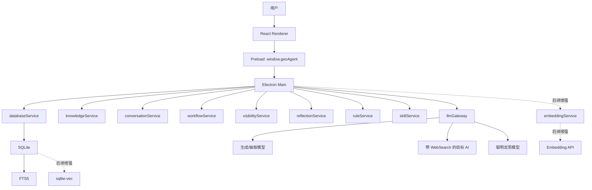

# GEO-Agent Studio 从零开发文档

> 文档版本：2026-06-01  
> 文档口径：从零开发，不兼容旧后端数据  
> 产品定位：轻量 AI 推荐可见性优化工作台  
> 推荐架构：Electron-only + React + SQLite/FTS/sqlite-vec + 火山方舟/DeepSeek/OpenAI 兼容模型  

---

## 1. 产品定位

### 1.1 一句话定位

GEO-Agent Studio 是一款轻量桌面软件，用来帮助企业提升在 AI 回答中的可见性、引用率和推荐概率。

它不是传统 SEO 工具，也不是重型 Agent 平台。它的目标不是监控网页排名，而是围绕一个更直接的问题工作：

```text
当用户向 AI 问“哪家公司好、哪家值得推荐、某地区某服务怎么选”时，AI 是否看见、理解、引用并推荐目标企业？
```

### 1.2 产品核心价值

软件帮助用户完成四件事：

1. 把企业资料整理成 AI 可理解的结构化知识库。
2. 推演真实用户会向 AI 提问的推荐类、排行榜类、采购类问题。
3. 先生成企业品牌、业务和产品支撑文章，再生成更容易被 AI 理解和引用的排行榜文章。
4. 用目标 AI + WebSearch 检测目标企业是否被推荐，并基于结果反思优化。

### 1.3 目标用户

目标用户包括：

- GEO/SEO 服务商。
- 本地生活企业运营人员。
- ToB 企业市场人员。
- 内容营销团队。
- 希望被 AI 推荐和引用的品牌方。

## 2. 核心目标

### 2.1 GEO 的目标定义

本软件中的 GEO 指生成式引擎优化，目标是让目标企业在 AI 回答中获得更高推荐可见性。

核心指标：

| 指标 | 含义 |
|---|---|
| 是否出现 | AI 回答中是否提到目标企业 |
| 推荐排名 | 目标企业在推荐名单中的位置 |
| 推荐理由 | AI 为什么推荐目标企业 |
| 引用来源 | AI 是否引用或参考了目标企业相关内容 |
| 竞品对比 | 同一回答中出现了哪些竞品 |
| 内容缺口 | 未上榜或排名低的原因 |

### 2.2 软件要解决的问题

用户当前通常面临这些问题：

- 企业资料散落在官网、PDF、宣传册、案例文档中。
- AI 不知道企业真实优势。
- AI 回答推荐类问题时更容易推荐竞品。
- 企业不知道用户会向 AI 问哪些问题。
- 企业不知道自己有没有被 AI 推荐。
- 企业不知道应该补充什么内容才能提高推荐概率。

### 2.3 最小闭环

第一版应围绕这个闭环开发：

```text
企业资料 -> 本地知识库 -> AI 问题池 -> 高权重信源发现 -> 内容矩阵 -> 首轮 9 篇稿件 -> 稿件管理 -> 分发投放 -> AI 推荐可见性检测 -> 反思优化建议
```

---

## 3. 用户流程

### 3.1 新用户首次使用

1. 用户打开软件。
2. 点击“上传资料创建知识库”。
3. 上传 PDF、DOCX、Markdown、TXT，或粘贴官网/企业资料。
4. 系统解析资料。
5. AI 抽取企业事实。
6. 用户逐项确认企业字段。
7. 系统写入本地知识库并建立检索索引。
8. 用户进入智能助手或 GEO 工作流。

### 3.2 GEO 优化流程

GEO 的业务目标是让目标企业进入 AI 的推荐、比较和排行榜回答。排行榜文章不能空穴来风，必须先让互联网上出现足够清晰、可引用的企业介绍、产品业务、优势证据和测评信息。

第一版按“先支撑、后排行榜”的顺序推进：

1. 用户选择目标企业。
2. 系统基于知识库和 target_keywords 生成 10 条 AI 核心问题。
3. 系统自动确认这 10 条核心问题，作为本轮 GEO 北极星问题。
4. 系统发现高权重信源，整理发布渠道优先级。
5. 系统基于问题池和信源优先级生成内容矩阵策略。
6. 系统一次性生成首轮 9 篇稿件草稿。
7. 稿件进入稿件管理页面。
8. 用户在稿件管理页用富文本编辑器校对、手动修改，或对任意单篇稿件提出修改意见让 AI 调整。
9. 稿件管理页后续接入发稿平台 API，负责投递、排期、状态同步和发布 URL 回填。
10. 系统用目标 AI + WebSearch 检测目标企业是否被推荐。
11. 系统保存 AI 回答、排名、竞品和引用来源。
12. 反思模型分析成功/失败原因并生成优化规则建议。
13. 用户确认后规则进入规则库，下一轮生成自动引用已确认规则。

### 3.3 用户体验原则

- 用户不需要理解复杂 Agent 流程。
- 每一步都能看到输入、输出和来源。
- AI 抽取结果必须可编辑。
- AI 生成内容必须可确认。
- AI 推荐检测必须保存完整回答。
- 反思建议必须由用户确认后才生效。

---

## 4. 第一版功能边界

### 4.1 第一版必须完成

当前开发口径：阶段三“高权重信源发现”和阶段四“支撑文章/排行榜文章生成”仍是待补齐的真实业务流程，不能只停留在前端按钮、占位接口或模型推断式报告。

| 模块 | 是否必须 | 说明 |
|---|---|---|
| 企业知识库创建 | 是 | 上传/粘贴资料，AI 抽取，用户确认，入库 |
| 本地 RAG | 是 | FTS 关键词检索，sqlite-vec 语义检索可选增强 |
| 智能助手 | 是 | 基于当前企业知识库聊天 |
| 聊天历史 | 是 | 按企业隔离，只保存真实聊天 |
| AI 问题池 | 是 | 按地域级次生成推荐类、排行榜类、比较类、科普避坑类、区域/价格类问题 |
| 高权重信源发现 | 是 | 基于 AI 自述偏好和联网回答实测 URL，整理发布渠道优先级 |
| 内容矩阵策略 | 是 | 基于问题池和信源优先级规划首轮 9 篇稿件 |
| 首轮稿件生成 | 是 | 一次性生成 9 篇草稿：6 篇支撑稿、3 篇排行榜稿，并流转到稿件管理页 |
| 稿件管理 | 是 | 富文本编辑、手动编辑、单篇 AI 改稿、状态管理和分发状态 |
| AI 推荐可见性检测 | 建议做 | 用目标 AI + WebSearch 检测是否被推荐 |
| 反思优化建议 | 建议做 | 用聪明模型生成规则建议，用户确认后生效 |
| 仪表盘数据看板 | 是 | 通过数据可视化按企业监控发稿后的推荐情况、引用情况、发布状态和内容矩阵进度 |
| AI网页构建 | 是 | 引用企业知识库一键生成可部署官网/专题页，支持下载源文件 |

### 4.2 后续开发重点

- 批量检测。
- 定时检测。
- 多账号模型配置。
- 仪表盘数据看板增强，按企业监控发稿后的推荐、引用、分发和内容矩阵效果。
- 接入发稿平台 API，在稿件管理页完成投递、排期、状态同步和发布 URL 回填。
- 完成 AI网页构建，基于企业知识库生成可直接部署的网址，并支持下载源文件。

### 4.3 不做传统收录检测

本软件不把“网页是否被搜索引擎收录”作为第一目标。

更准确的目标是：

```text
AI 推荐可见性检测
```

即：目标 AI 在回答目标问题时是否推荐目标企业。

---

## 5. 推荐技术栈

### 5.1 桌面和前端

| 技术 | 用途 |
|---|---|
| Electron | 桌面应用壳 |
| React | UI |
| TypeScript | 类型系统 |
| Vite | 开发和构建 |
| Tailwind CSS | 样式 |
| Radix UI | 基础交互组件 |
| ai-elements | Chat、Message、Queue、Confirmation、Sources |

### 5.2 本地服务层

| 技术 | 用途 |
|---|---|
| Electron Main | 本地后端 |
| Preload | 暴露 `window.geoAgent` |
| SQLite | 本地数据 |
| FTS5 | 关键词检索 |
| sqlite-vec | 预留本地向量检索增强 |
| pdf-parse | PDF 解析 |
| mammoth | DOCX 解析 |

### 5.3 模型服务

| 模型类型 | 用途 |
|---|---|
| 抽取模型 | 企业资料事实抽取 |
| 生成模型 | 问题池、内容矩阵、支撑文章和排行榜文章生成 |
| Embedding 模型 | 后续混合检索增强，当前主流程不依赖 |
| 验证模型 | AI 推荐检测结果结构化 |
| 反思模型 | 成功/失败样本分析和优化建议 |

### 5.4 模型配置建议

取消“调度模型”概念。

改为任务模型配置：

```env
# 通用生成模型
GENERATION_API_KEY=
GENERATION_BASE_URL=
GENERATION_MODEL=

# 抽取模型
EXTRACTION_API_KEY=
EXTRACTION_BASE_URL=
EXTRACTION_MODEL=

# 火山方舟 Embedding API（预留增强项，当前版本默认不启用）
ARK_API_KEY=
ARK_EMBEDDING_BASE_URL=https://ark.cn-beijing.volces.com/api/v3
ARK_EMBEDDING_MODEL=doubao-embedding-vision-251215
ARK_EMBEDDING_DIMENSIONS=1024
ARK_EMBEDDING_CONCURRENCY=2
ARK_EMBEDDING_MAX_RETRIES=2

# AI 推荐检测模型
VISIBILITY_API_KEY=
VISIBILITY_BASE_URL=
VISIBILITY_MODEL=

# 反思模型，可配置更聪明模型
REFLECTION_API_KEY=
REFLECTION_BASE_URL=
REFLECTION_MODEL=
```

反思模型可以使用 GPT-5.4 或同等级聪明模型，但它不是主流程依赖，只在反思优化阶段调用。

当前版本的知识库检索采用“结构化字段优先 + SQLite FTS5 全文检索辅助”的本地方案。火山方舟 Embedding / sqlite-vec 作为后续混合检索增强预留；启用后也只负责把本地知识库 chunk 转成向量，企业资料、切片文本、向量和检索索引仍保存在本机，不上传到豆包云端知识库，也不创建云端知识库资源。

---

## 6. 总体架构

### 6.1 架构原则

```text
React 负责界面，Electron Main 负责本地后端，SQLite 负责数据，workflow events 负责流程恢复，普通聊天历史只保存真实用户对话。
```

### 6.2 架构图



### 6.3 服务职责

| 服务 | 职责 |
|---|---|
| `databaseService` | SQLite 初始化、schema、事务、FTS、sqlite-vec |
| `knowledgeService` | 知识库草稿、事实抽取、字段确认、入库、检索 |
| `conversationService` | 普通聊天、历史、企业隔离 |
| `workflowService` | GEO 流程状态、阶段产物、workflow events |
| `sourceDiscoveryService` | 双层证据的高权重信源发现、渠道优先级和主题建议 |
| `articleService` | 内容矩阵、9 篇稿件生成、富文本草稿、单篇 AI 改稿和稿件状态 |
| `visibilityService` | AI 推荐可见性检测 |
| `reflectionService` | 成功/失败样本反思分析 |
| `ruleService` | 规则建议、规则确认、规则读取 |
| `skillService` | 中文 `SKILL.md` 读取和 prompt 规范 |
| `llmGateway` | 统一 LLM、WebSearch、JSON、流式调用 |
| `embeddingService` | 后续混合检索增强：Embedding 队列、重试、向量写入 |

---

## 7. 数据模型

### 7.1 数据隔离原则

所有企业相关数据必须绑定 `project_id`。

必须隔离的数据包括：

- 企业知识库。
- 知识 chunks。
- 后续可选向量索引。
- 聊天历史。
- 问题池。
- 内容草稿。
- AI 推荐检测结果。
- 反思报告。
- 进化规则。

### 7.2 核心表

#### projects

企业项目。

```sql
CREATE TABLE projects (
  id TEXT PRIMARY KEY,
  name TEXT NOT NULL,
  description TEXT,
  created_at TEXT NOT NULL,
  updated_at TEXT NOT NULL
);
```

#### enterprise_profiles

用户确认后的企业结构化资料。

```sql
CREATE TABLE enterprise_profiles (
  project_id TEXT PRIMARY KEY REFERENCES projects(id) ON DELETE CASCADE,
  profile_json TEXT NOT NULL,
  source_draft_id TEXT,
  created_at TEXT NOT NULL,
  updated_at TEXT NOT NULL
);
```

#### knowledge_drafts

知识库草稿。

```sql
CREATE TABLE knowledge_drafts (
  id TEXT PRIMARY KEY,
  project_id TEXT,
  status TEXT NOT NULL,
  input_text TEXT,
  facts_json TEXT,
  field_reviews_json TEXT,
  profile_json TEXT,
  source_quotes_json TEXT,
  warnings_json TEXT,
  created_at TEXT NOT NULL,
  updated_at TEXT NOT NULL
);
```

#### knowledge_entries

正式知识条目。

```sql
CREATE TABLE knowledge_entries (
  id TEXT PRIMARY KEY,
  project_id TEXT NOT NULL REFERENCES projects(id) ON DELETE CASCADE,
  type TEXT NOT NULL,
  title TEXT NOT NULL,
  content TEXT NOT NULL,
  metadata_json TEXT,
  created_at TEXT NOT NULL,
  updated_at TEXT NOT NULL
);
```

#### knowledge_chunks

知识切片。

```sql
CREATE TABLE knowledge_chunks (
  id TEXT PRIMARY KEY,
  project_id TEXT NOT NULL REFERENCES projects(id) ON DELETE CASCADE,
  entry_id TEXT REFERENCES knowledge_entries(id) ON DELETE CASCADE,
  title TEXT,
  content TEXT NOT NULL,
  content_hash TEXT NOT NULL,
  metadata_json TEXT,
  created_at TEXT NOT NULL
);
```

#### conversations

普通聊天会话。

```sql
CREATE TABLE conversations (
  id TEXT PRIMARY KEY,
  project_id TEXT NOT NULL REFERENCES projects(id) ON DELETE CASCADE,
  kind TEXT NOT NULL DEFAULT 'chat',
  title TEXT NOT NULL,
  created_at TEXT NOT NULL,
  updated_at TEXT NOT NULL
);
```

#### messages

普通聊天消息。

```sql
CREATE TABLE messages (
  id TEXT PRIMARY KEY,
  conversation_id TEXT NOT NULL REFERENCES conversations(id) ON DELETE CASCADE,
  project_id TEXT NOT NULL REFERENCES projects(id) ON DELETE CASCADE,
  role TEXT NOT NULL,
  content TEXT NOT NULL,
  metadata_json TEXT,
  created_at TEXT NOT NULL
);
```

#### workflow_events

流程事件。

```sql
CREATE TABLE workflow_events (
  id TEXT PRIMARY KEY,
  project_id TEXT NOT NULL REFERENCES projects(id) ON DELETE CASCADE,
  stage_key TEXT NOT NULL,
  event_type TEXT NOT NULL,
  status TEXT NOT NULL,
  title TEXT NOT NULL,
  content TEXT,
  artifact_type TEXT,
  artifact_id TEXT,
  metadata_json TEXT,
  created_at TEXT NOT NULL,
  updated_at TEXT NOT NULL
);
```

#### geo_question_sets

AI 问题池。

```sql
CREATE TABLE geo_question_sets (
  id TEXT PRIMARY KEY,
  project_id TEXT NOT NULL REFERENCES projects(id) ON DELETE CASCADE,
  platform TEXT NOT NULL,
  questions_json TEXT NOT NULL,
  status TEXT NOT NULL,
  created_at TEXT NOT NULL,
  updated_at TEXT NOT NULL
);
```

#### geo_article_drafts

文章草稿和发布记录。它同时承载支撑文章和排行榜文章，但第一版必须用 `article_role` 区分内容目的。

```sql
CREATE TABLE geo_article_drafts (
  id TEXT PRIMARY KEY,
  project_id TEXT NOT NULL REFERENCES projects(id) ON DELETE CASCADE,
  question_set_id TEXT REFERENCES geo_question_sets(id) ON DELETE SET NULL,
  source_discovery_id TEXT REFERENCES geo_source_discoveries(id) ON DELETE SET NULL,
  platform TEXT NOT NULL,
  article_role TEXT NOT NULL,
  article_type TEXT NOT NULL,
  title TEXT NOT NULL,
  content TEXT NOT NULL,
  target_question TEXT,
  suggested_channel TEXT,
  publish_status TEXT NOT NULL DEFAULT 'draft',
  published_url TEXT,
  published_at TEXT,
  citations_json TEXT,
  facts_used_json TEXT,
  matrix_json TEXT,
  status TEXT NOT NULL,
  created_at TEXT NOT NULL,
  updated_at TEXT NOT NULL
);
```

字段口径：

- `article_role`: `support` 或 `ranking`。支撑文章必须先于排行榜文章生成和发布。
- `article_type`: 支撑文章可为 `brand_profile`、`business_review`；排行榜文章为 `ranking`。
- `target_question`: 对应 AI 问题池中的真实用户问题，排行榜文章标题和正文必须围绕它生成。
- `suggested_channel`: 来自高权重信源发现的建议发布渠道。
- `publish_status`: `draft`、`reviewed`、`scheduled`、`published`、`failed` 等分发状态。
- `published_url`: 发稿平台 API 或人工回填的公开 URL，供后续 AI 推荐检测和反思使用。
- `content`: 保存富文本正文的规范化内容，第一版可用 HTML 或 Markdown，但对外编辑体验必须是富文本。

#### geo_source_discoveries

高权重信源发现结果。它不代表已发稿，也不代表爬虫采集结果，而是根据问题池、企业资料和目标 AI WebSearch 观察生成的“发布渠道优先级”。

```sql
CREATE TABLE geo_source_discoveries (
  id TEXT PRIMARY KEY,
  project_id TEXT NOT NULL REFERENCES projects(id) ON DELETE CASCADE,
  question_set_id TEXT REFERENCES geo_question_sets(id) ON DELETE SET NULL,
  platform TEXT NOT NULL,
  status TEXT NOT NULL,
  source_name TEXT,
  source_url TEXT,
  source_type TEXT,
  content_format TEXT,
  priority_score REAL NOT NULL DEFAULT 0,
  reason TEXT,
  observed_in_answers TEXT,
  recommended_topics TEXT,
  discovery_json TEXT NOT NULL,
  confirmed_at TEXT,
  created_at TEXT NOT NULL,
  updated_at TEXT NOT NULL
);
```

#### ai_visibility_checks

AI 推荐可见性检测结果。

```sql
CREATE TABLE ai_visibility_checks (
  id TEXT PRIMARY KEY,
  project_id TEXT NOT NULL REFERENCES projects(id) ON DELETE CASCADE,
  question_id TEXT,
  platform TEXT NOT NULL,
  query TEXT NOT NULL,
  answer_text TEXT NOT NULL,
  target_mentioned INTEGER NOT NULL DEFAULT 0,
  target_rank INTEGER,
  target_context TEXT,
  competitors_json TEXT,
  cited_sources_json TEXT,
  analysis_json TEXT,
  checked_at TEXT NOT NULL,
  created_at TEXT NOT NULL
);
```

#### evolution_rules

用户确认后的优化规则。

```sql
CREATE TABLE evolution_rules (
  id TEXT PRIMARY KEY,
  project_id TEXT NOT NULL REFERENCES projects(id) ON DELETE CASCADE,
  platform TEXT,
  rule_type TEXT NOT NULL,
  content TEXT NOT NULL,
  evidence_count INTEGER NOT NULL DEFAULT 0,
  confidence REAL NOT NULL DEFAULT 0,
  status TEXT NOT NULL,
  created_at TEXT NOT NULL,
  updated_at TEXT NOT NULL
);
```

---

## 8. 企业知识库创建

### 8.1 阶段目标

企业知识库录入是 GEO 流程的第一步，目标不是生成宽泛企业介绍，而是建立可被后续问题池、信源发现、稿件生成和 AI 推荐检测复用的高精度事实档案。

```text
输入企业资料 -> 严格事实抽取 -> 字段核对确认 -> 入库与索引
```

第一版只处理用户上传或粘贴文本中明确出现的事实，不做自动 OCR、网页抓取或外部工商查询。

### 8.2 资料导入

支持：

- PDF。
- DOCX。
- Markdown。
- TXT。
- 粘贴官网内容。
- 粘贴产品、案例、资质、服务区域、关键词资料。

要求：

- 文件解析结果可见。
- 解析失败原因可见。
- 附件内容和用户指令分开保存。
- 不把“帮我创建知识库”当作企业事实。
- 不把文件名当公司名。

### 8.3 AI 事实抽取

每个字段必须保存为证据包结构：

```ts
type KnowledgeProfileField<T = string | string[] | null> = {
  value: T;
  source_quote: string | null;
  confidence: number;
};
```

字段清单：

| 字段 | 中文名 | GEO 价值 |
|---|---|---|
| `company_name` | 公司官方名称 | 企业实体识别。 |
| `short_name` | 品牌/公司简称 | AI 回答中的自然提及名称。 |
| `detailed_address` | 详细经营地址 | 区域性推荐、本地检索召回。 |
| `business_regions` | 业务服务区域 | 城市/区域问题池和本地榜单。 |
| `industry_category` | 所属行业分类 | 问题池和信源发现的行业上下文。 |
| `offerings` | 产品与服务项目 | 合并旧 `main_business` 与 `products_services`，减少重复抽取。 |
| `associated_brands` | 关联/代理品牌 | 品牌对比、代理授权和大牌检索召回。 |
| `target_audiences` | 目标客群/适用车型 | 精准场景推荐。 |
| `core_advantages` | 核心差异化优势 | 排行榜推荐理由。 |
| `trust_endorsements` | 信任背书与资质 | AI 推荐可信度支撑。 |
| `user_pain_points` | 解决的用户痛点 | 支撑稿和问题池意图来源。 |
| `proven_cases` | 客户案例 | 测评、案例、推荐理由证据。 |
| `target_keywords` | 核心业务关键词 | 问题池和内容标题参考。 |
| `contact_info` | 联系方式 | 企业实体完整度和转化信息。 |

规则：

- `source_quote` 必须能在原文中通过字符串匹配找到。
- 原文未提及的字段使用 `null` 或 `[]`，不得脑补。
- `source_quote` 为 `null` 时，`confidence` 不得高于 `0.8`。
- `main_business`、`products_services`、`cases`、`customer_service_phone`、`industry` 不再作为新流程输出字段。

### 8.4 字段核对确认

用户确认界面展示字段值、原文引用和置信度。用户确认前不写正式企业知识库。

必核字段：

- 公司官方名称。
- 详细经营地址。
- 业务服务区域。
- 所属行业分类。
- 产品与服务项目。
- 核心差异化优势。
- 信任背书与资质。
- 核心业务关键词。

### 8.5 入库与索引

确认后执行：

1. 写入 `projects`。
2. 写入 `enterprise_profiles`。
3. 写入 `knowledge_entries`。
4. 切分 `knowledge_chunks`。
5. 写入 FTS5。
6. 更新 workflow event 和知识库索引状态。

当前版本检索规则：

- 企业结构化字段是文章生成和问题池生成的主事实源。
- `knowledge_chunks` 与 FTS5 用于辅助召回原文证据。
- Embedding / sqlite-vec 不作为当前阶段三、阶段四的上线前置条件。
- 后续启用 Embedding 时，应采用混合检索：结构化字段优先，FTS 精确召回，Embedding 语义召回，最终按证据可信度排序。

---

## 9. AI 问题池：知识库 + 目标词驱动的 10 条核心问题

### 9.1 问题池定位

第二阶段问题池用于模拟真实用户向 AI 提问的方式，并服务项目核心目标：让目标企业进入 AI 的推荐、排行榜、口碑、对比和“哪家好”类回答。

系统直接基于第一阶段企业知识库和 `target_keywords` 生成 10 条核心问题。10 条问题生成后自动确认为本轮 GEO 优化的北极星问题，供阶段三信源发现、首轮 9 篇稿件生成和后续 Visibility Rate 检测使用。

`target_keywords` 是问题生成主线，但不是唯一输入。问题必须同时参考企业知识库中的地域、行业、服务、客群、痛点、案例、优势和信任背书，避免只围绕关键词生硬拼接。

### 9.2 target_keywords 组成逻辑

`target_keywords` 建议由三部分组成：

```text
地区范围 + 行业规范统称 + 主体
```

示例：

| 地区范围 | 行业规范统称 | 主体 | target_keywords 示例 |
|---|---|---|---|
| 成都 | 汽车音响改装 | 门店 | 成都汽车音响改装门店 |
| 成华区 | 种牙 | 机构 | 成华区种牙机构 |
| 陕西 | 岩土工程 | 公司 | 陕西岩土工程公司 |
| 全国 | 预制菜 | 供应商 | 全国预制菜供应商 |

系统可以在 `target_keywords` 缺失时基于知识库临时推导目标词，但必须在 `target_keyword_basis.warning` 中标记。

### 9.3 业务范围判断

问题生成前必须先判断 `business_scope`：

| business_scope | 适用情况 | 问题地域策略 |
|---|---|---|
| `district_local` | 单店、本地生活、诊所、汽车改装店等依赖周边客群的业务 | 优先生成城市、区县、商圈、附近、周边问题，可少量生成更宽泛的城市/省级/全国参考问题 |
| `city_local` | 城市级服务商、区域连锁、本地 ToB、同城交付业务 | 优先生成城市级问题，可搭配区县/区域和少量省级/全国参考问题 |
| `province_regional` | 明确服务省内多城或区域市场的业务 | 优先生成省级、城市群、区域服务问题，可包含重点城市问题 |
| `national_industry` | 全国性、ToB、SaaS、供应链、招商加盟、品牌总部 | 优先生成全国、国内、行业垂直问题；没有明确本地经营事实时，不强行加入城市或区县 |

本地企业不是完全不能生成全国问题，而是本地和区域问题应占主导。全国企业也不是完全不能生成城市问题，但必须有明确本地经营事实支撑。

### 9.4 10 条核心问题生成规则

固定生成 10 条核心问题，不再让用户手动筛选。

意图分布建议：

| intent | 数量 | 说明 |
|---|---:|---|
| `ranking_rec` | 7 | 排行榜、推荐、哪家好、口碑、性价比、值得选 |
| `comparison` | 1 | 对比竞品、品牌、方案、服务能力 |
| `scenario_price` | 1 | 具体痛点、预算、价格、售后、场景需求 |
| `educational_trust` | 1 | 怎么选、避坑、判断标准、资质背书 |

关键词层级建议：

| keyword_layer | 数量 | 说明 |
|---|---:|---|
| `core` | 3 | 高权重行业大词、城市大词、全国行业词 |
| `regional` | 3 | 区域、区县、商圈、附近、省份、城市群 |
| `scenario` | 2 | 具体痛点、人群、车型、行业场景、需求 |
| `long_tail` | 2 | 提问式、攻略型、避坑型、价格型长尾问题 |

问题写法应接近真实用户表达，例如：

- 全国 [行业/产品] 排行榜有哪些？
- 陕西 [行业] 公司哪家实力比较强？
- 成都 [服务] 做得好的公司有哪些？
- 成华区 [服务] 哪一家比较好？
- 成都做 [服务] 哪一家性价比比较高？
- [目标人群/车型/场景] 适合选哪种 [服务/方案]？
- [本品/本企业] 和 [竞品/通用方案] 相比优势在哪里？
- 做 [服务] 怎么判断质量好不好？

### 9.5 问题池与 9 篇稿件的映射

10 条核心问题不是和 9 篇稿件一对一对应，而是用于指导内容资产的语义网络。

| asset_id | 角色 | 主题 | 优先映射问题 |
|---|---|---|---|
| `support_1` | support | 行业科普 / 避坑指南 | `educational_trust`、`long_tail` |
| `support_2` | support | 工艺流程 / 服务标准 | `scenario_price`、`educational_trust` |
| `support_3` | support | 深度测评 / 数据实测 | `comparison`、`scenario` |
| `support_4` | support | 真实案例 / 口碑展示 | `scenario`、`ranking_rec` |
| `support_5` | support | 本地服务 / 售后承诺 | `regional`、`scenario_price` |
| `support_6` | support | 差异化对比 / 分析 | `comparison`、`core` |
| `rank_1` | ranking | 综合推荐 / 行业排行 | `ranking_rec`、`core` |
| `rank_2` | ranking | 细分场景 / 人群推荐 | `ranking_rec`、`scenario` |
| `rank_3` | ranking | 区域性 / 本地化推荐 | `ranking_rec`、`regional` |

排行榜类问题优先服务 3 篇排行榜稿，支撑类问题用于解释推荐理由、服务标准、案例证据和差异化依据。

### 9.6 保存结构

```ts
type GeoQuestionSet = {
  id: string;
  project_id: string;
  platform: string;
  status: 'confirmed';
  questions_json: {
    summary: string;
    business_scope: 'district_local' | 'city_local' | 'province_regional' | 'national_industry';
    target_keyword_basis: Array<{ keyword: string; source: string; usage: string; warning?: string }>;
    knowledge_basis: Record<string, unknown>;
    candidate_questions: GeoQuestion[];
    question_pool: GeoQuestion[];
    recommended_core_questions: string[];
    confirmed_questions: GeoQuestion[];
    intent_distribution: Record<string, number>;
    keyword_layer_distribution: Record<string, number>;
    content_asset_mapping: Array<Record<string, unknown>>;
  };
};
```

`candidate_questions`、`question_pool`、`confirmed_questions` 保留为兼容字段，但新流程中三者都指向同一批 10 条核心问题。

```ts
type GeoQuestion = {
  id: string;
  question: string;
  intent: 'ranking_rec' | 'comparison' | 'scenario_price' | 'educational_trust';
  keyword_layer: 'core' | 'regional' | 'scenario' | 'long_tail';
  priority: number;
  target_keyword_used: string;
  knowledge_fields_used: string[];
  geo_terms_used: string[];
  scope_reason: string;
  ranking_bias: 'high' | 'medium' | 'low';
  related_keywords: string[];
  mapped_asset_ids: string[];
  status: 'confirmed';
  confirmed: true;
};
```

### 9.7 工程约束

1. 阶段二必须实际读取 `skills/geo-question-set.md` 作为问题池生成规范。
2. Prompt 必须显式注入完整企业知识库和 `target_keywords`。
3. 模型输出必须正好 10 条问题；不足或超出时允许自动修复一次。
4. 阶段二保存后 `status` 直接为 `confirmed`。
5. 阶段三、高权重信源发现、内容生成和 Visibility Rate 检测读取 `confirmed_questions`。
6. 旧问题池记录仍可展示，但新流程不再出现用户勾选确认卡。
7. 不得编造企业不存在的业务、荣誉、排名、资质、城市覆盖、合作品牌或案例。

---
## 10. 高权重信源发现

### 10.1 信源发现目标

高权重信源发现用于回答：目标 AI 更容易引用哪些公开平台、网站、文章类型和证据结构。

它不是发稿系统，也不是传统爬虫；它只为后续内容生成和发布渠道选择提供优先级。

第一版必须把信源证据分成两层：

1. AI 自述偏好：询问目标 AI 或同类模型，在当前行业、问题类型下更倾向参考哪些平台、站点和内容形态。
2. 联网回答实测：用问题池中的高优先级问题向目标平台的智能助手提问，并开启联网能力，记录它在回答过程中检索或引用的网址。

实测引用 URL 的权重高于 AI 自述偏好。AI 自述偏好只能作为候选渠道，不能被写成“已经被引用”。

### 10.2 触发条件

AI 问题池生成并确认后触发。

### 10.3 输入

- 企业资料。
- AI 问题池。
- 目标平台，例如 ChatGPT、豆包、DeepSeek、Kimi、Perplexity。
- 目标行业、业务类型、用户场景。

### 10.4 动作

1. 从问题池选择 5-8 个高优先级推荐、排行榜、比较类问题。
2. 询问目标 AI 的行业信源偏好，得到候选平台和内容形态。
3. 用高优先级问题向目标 AI 发起联网提问，观察回答中检索和引用的 URL。
4. 记录 AI 回答中出现的引用来源、竞品来源、文章类型和证据线索。
5. 按“实测 URL > 多次出现 > 渠道可信度 > 内容匹配度 > AI 自述偏好”的顺序合并评分。
6. 输出发布渠道优先级、内容形态、证据结构和适合发布的主题。

### 10.5 输出

```ts
type GeoSourceDiscovery = {
  id: string;
  project_id: string;
  question_set_id?: string | null;
  platform: string;
  channel_priorities: Array<{
    source_name: string;
    source_url?: string | null;
    source_type: string;
    content_format: string;
    priority_score: number;
    reason: string;
    observed_in_answers: string;
    evidence_level: 'observed_url' | 'ai_preference' | 'manual_candidate';
    recommended_topics: string[];
  }>;
  observed_citation_sources: Array<{
    url: string;
    title?: string;
    cited_in_question: string;
    answer_excerpt?: string;
  }>;
  content_distribution_strategy: {
    primary_channels: string[];
    content_formats: string[];
    citation_structure: string;
    next_step: string;
  };
};
```

### 10.6 质量要求

- 不编造“已引用”事实。
- 没有真实 URL 时可以留空，但必须说明判断依据。
- 输出必须服务后续支撑文章和排行榜文章生成。
- 第一版只输出发布渠道优先级，不做自动发稿。
- 第一版不做爬虫；信源来自 AI 联网回答观察、模型偏好询问和人工候选补充。

---

## 11. 内容矩阵策略

### 11.1 内容矩阵目标

内容矩阵用于把问题池和信源发现结果转成可执行的首轮稿件计划。它不是单篇文章生成，而是一次性规划并生成 9 篇草稿，然后统一流转到稿件管理页。

第一版采用“首轮 9 篇最小内容包”：

| 内容角色 | 数量 | 类型 | 目标 |
|---|---:|---|---|
| 支撑文章 | 3 篇 | 企业介绍/品牌形象建设 | 让互联网中出现企业是谁、服务谁、有什么优势和背书 |
| 支撑文章 | 3 篇 | 业务/产品测评介绍 | 解释企业产品、服务方案、适用场景和评测标准 |
| 排行榜文章 | 3 篇 | 排行榜/推荐榜单 | 围绕 AI 问题池中的高优先级问题生成可被 AI 摘取的榜单内容 |

首轮 9 篇用于快速建立基础内容支撑和排行榜入口。它们一次性生成，但不代表一次性发布。根据 AI 推荐检测和反思结果，后续可追加第二轮内容，累计目标为 15-20 篇。

### 11.2 先支撑后排行榜

排行榜文章可以和支撑文章一起生成草稿，但发布和分发必须排在支撑文章之后。原因是 AI 在回答排行榜问题时需要引用公开内容中的企业事实、产品介绍、测评标准和推荐理由。

正确顺序：

```text
问题池 -> 信源发现 -> 内容矩阵 -> 一次性生成 9 篇草稿 -> 稿件管理页编辑校对 -> 支撑稿先分发 -> 排行榜稿后分发 -> 推荐检测
```

如果支撑稿还没有完成投放，稿件管理页应允许编辑排行榜稿，但在排期或投递时提示“排行榜稿依赖支撑稿先完成分发”。

### 11.3 内容矩阵输出

```ts
type GeoContentMatrix = {
  id: string;
  project_id: string;
  question_set_id: string;
  source_discovery_id: string;
  platform: string;
  target_total_articles: 9;
  long_term_target_articles: '15-20';
  items: Array<{
    article_role: 'support' | 'ranking';
    article_type: 'brand_profile' | 'business_review' | 'ranking';
    target_question: string;
    title_direction: string;
    suggested_channel: string;
    distribution_order: number;
    source_basis: string;
    required_facts: string[];
  }>;
};
```

---

## 12. 支撑文章生成

### 12.1 内容目标

支撑内容不是泛泛营销文章，而是为 AI 推荐提供可引用事实和推荐理由。

内容应帮助 AI 回答：

- 这家公司是谁？
- 为什么值得推荐？
- 适合什么用户？
- 解决什么问题？
- 有什么案例或背书？
- 与竞品有什么差异？

### 12.2 第一版支撑文章类型

| 类型 | 目标 |
|---|---|
| 企业介绍/品牌形象建设 | 建立企业是谁、服务范围、核心优势、信任背书和适合人群 |
| 业务/产品测评介绍 | 介绍产品服务、应用场景、评价标准、解决痛点和企业优势 |

推荐理由不作为首轮独立文章类型，而是作为每篇支撑文章和排行榜文章中的结构化模块，例如“推荐理由”“适合人群”“优势证据”“事实依据”。

### 12.3 内容生成输入

- 企业 profile。
- RAG top chunks。
- AI 问题池。
- 已确认高权重信源发现结果。
- 内容矩阵策略。
- 已确认 evolution rules。

### 12.4 内容质量要求

- 必须引用企业知识库事实。
- 不得编造案例和资质。
- 标题贴近问题池。
- 内容结构清晰，适合 AI 摘取。
- 每篇内容输出引用依据。
- 每篇文章必须标注建议发布渠道和对应信源依据。
- 生成后必须进入稿件管理页，支持富文本编辑、手动修改和 AI 单篇改稿。
- 支撑稿的分发顺序必须早于排行榜稿。

---

## 13. 排行榜文章生成

### 13.1 排行榜文章目标

排行榜文章的目标是服务 AI 推荐和榜单回答。它的标题、开头、结构和小标题都应参考 AI 问题池中的真实用户问题，而不是只写营销标题。

示例：

- 区县级问题池：`[城市][区县][行业]哪家比较好？`
- 排行榜标题：`[城市][区县][行业]哪家比较好？2026 年本地门店选择参考`
- 城市级问题池：`[城市][行业]口碑排行榜前三是谁？`
- 排行榜标题：`[城市][行业]口碑排行榜：从经验、能力和售后服务看怎么选`
- 全国级问题池：`国内靠谱的[行业]服务商有哪些？`
- 排行榜标题：`国内靠谱的[行业]服务商怎么选？从产品能力、案例和服务保障看推荐理由`

### 13.2 生成前置条件

排行榜文章草稿可以和支撑文章草稿一次性生成，但必须满足以下输入条件：

1. AI 问题池已确认。
2. 高权重信源发现已完成。
3. 内容矩阵已生成。

排行榜文章的发布和分发必须满足以下业务条件：

1. 首轮支撑稿已完成校对。
2. 支撑稿已优先投递或排期。
3. 排行榜稿在稿件管理页通过校对后再进入分发。

### 13.3 内容结构

排行榜文章应包含：

- 用户问题引入。
- 排名或推荐标准说明。
- 候选企业或方案对比。
- 目标企业的自然推荐理由。
- 引用支撑文章中的企业事实和测评依据。
- 适合 AI 摘取的结构化摘要。
- 建议发布渠道和来源依据。

### 13.4 质量要求

- 不得编造排名来源、奖项、案例和资质。
- 如果没有外部权威排名，只能写“选择参考”“推荐参考”“本地服务对比”，不能伪装成官方榜单。
- 标题必须对应问题池中的高优先级问题。
- 内容必须引用支撑稿中的企业事实、测评依据和企业知识库事实。
- 生成后必须进入稿件管理页，支持富文本编辑、手动修改和 AI 单篇改稿。
- 分发后必须由发稿平台 API 或人工回填发布 URL，供后续 AI 推荐检测和反思使用。

---

## 14. 稿件管理与分发边界

### 14.1 智能助手边界

智能助手只负责把阶段二、阶段三和内容矩阵转成首轮 9 篇稿件草稿，并把稿件流转到稿件管理页。智能助手不承担富文本编辑、人工校对、排期、投递和发布状态管理。

### 14.2 稿件管理页职责

稿件管理页是“稿件创作与分发管理”的核心工作台，负责：

1. 展示首轮 9 篇稿件。
2. 标记稿件角色、建议渠道、GEO 合规分数、创作状态和分发状态。
3. 用富文本编辑器编辑稿件正文。
4. 支持用户手动修改。
5. 支持用户对任意单篇稿件提出修改意见，让 AI 重写或局部调整。
6. 管理草稿、已校对、已排期、已发布、发布失败等状态。
7. 在后续接入发稿平台 API 后完成投递、排期、状态同步和发布 URL 回填。

发布 URL 是后续 AI 推荐检测和反思优化的重要证据。没有发布 URL 的稿件只能算草稿或待分发内容，不能算已形成互联网内容支撑。

### 14.3 发稿平台 API

后续接入发稿平台 API 后，在稿件管理页增加：

- 自动选择渠道。
- 自动提交稿件。
- 支持稿件排期。
- 自动同步发布状态。
- 自动回填发布 URL。
- 按渠道统计发稿成功率和 AI 引用效果。

---

## 15. AI 推荐可见性检测

### 15.1 为什么不用爬虫

传统爬虫复杂、不稳定、维护成本高，而且不一定能反映 GEO 的真实目标。

GEO 更关心的是：

```text
AI 回答用户问题时有没有推荐目标企业。
```

因此验证方式采用：

```text
目标 AI + WebSearch 提问检测
```

### 15.2 检测流程

1. 从问题池选择问题。
2. 调用目标 AI 的 WebSearch 能力。
3. 要求 AI 联网回答推荐名单和理由。
4. 保存完整回答。
5. 结构化解析回答。
6. 判断目标企业是否出现。
7. 记录排名、推荐理由、竞品和引用来源。
8. 对照已发布支撑文章和排行榜文章 URL，判断 AI 是否引用了本轮内容资产。

### 15.3 检测 prompt 示例

```text
请联网搜索并回答：{question}

要求：
1. 给出你会推荐的企业或品牌名单。
2. 说明每个推荐对象的理由。
3. 如果有来源，请列出来源标题和链接。
4. 不要为了迎合用户强行推荐某个企业。
```

### 15.4 检测结果结构

```ts
type AiVisibilityCheck = {
  id: string;
  project_id: string;
  question: string;
  platform: 'doubao' | 'deepseek' | 'kimi' | 'yuanbao' | 'chatgpt' | string;
  answer_text: string;
  target_company_mentioned: boolean;
  target_company_rank: number | null;
  target_company_context: string | null;
  competitors: Array<{
    name: string;
    rank: number | null;
    reason: string;
  }>;
  cited_sources: Array<{
    title: string;
    url?: string;
    snippet?: string;
  }>;
  matched_published_urls: string[];
  checked_at: string;
};
```

### 15.5 UI 展示

推荐可见性页面展示：

- 检测问题。
- 检测平台。
- 是否上榜。
- 上榜位置。
- AI 推荐理由。
- 竞品列表。
- 引用来源。
- 是否引用本轮已发布内容。
- 完整回答。
- 历史趋势。

---

## 16. 反思优化系统

### 16.1 设计原则

自动进化不是黑箱自动改规则。

正确流程：

```text
采集证据 -> 对比样本 -> 聪明模型反思 -> 生成建议 -> 用户确认 -> 更新规则库
```

### 16.2 输入数据

反思系统输入：

- 企业 profile。
- 问题池。
- 支撑文章。
- 排行榜文章。
- 发布 URL。
- AI 推荐检测结果。
- 竞品名单。
- 引用来源。
- 已确认规则。

### 16.3 反思分析内容

聪明模型分析：

- 成功上榜的问题有什么共同点。
- 未上榜的问题缺少什么证据。
- 竞品为什么被推荐。
- 目标企业的推荐理由是否清晰。
- 哪些企业字段需要补充。
- 哪些内容结构更容易被引用。
- 下一轮内容应该强化什么。
- 首轮 9 篇是否需要补齐第二轮内容，向 15-20 篇累计目标推进。

### 16.4 规则建议结构

```ts
type EvolutionRuleSuggestion = {
  id: string;
  project_id: string;
  platform?: string;
  rule_type: 'title' | 'structure' | 'evidence' | 'keyword' | 'source' | 'avoid';
  content: string;
  reason: string;
  evidence_count: number;
  confidence: number;
  status: 'suggested' | 'approved' | 'rejected';
};
```

### 16.5 用户确认

系统只能生成建议。

只有用户点击确认后：

- 规则写入 `evolution_rules`。
- 下一轮问题池生成可读取规则。
- 下一轮内容生成可读取规则。
- 下一轮推荐检测可读取规则。

---

## 17. Skills / Prompt 规范

### 17.1 Skills 定位

Skills 是中文 prompt 规范，不是脚本执行系统。

用途：

- 约束模型输出。
- 固定结构化格式。
- 统一质量要求。
- 避免 prompt 散落在代码里。

### 17.2 用户可见技能

第一版智能助手只显示：

```text
企业知识库创建
```

对应 skill：

```text
knowledge-base-ingest
```

### 17.3 内部技能

内部 skills：

- `geo-question-set`
- `geo-source-discovery`
- `geo-content-matrix`
- `geo-support-content`
- `geo-ranking-article`
- `geo-visibility-check`
- `geo-reflection`

这些不在技能下拉中展示，由系统流程自动调用。

### 17.4 Skill 文件格式

```markdown
---
name: geo-visibility-check
description: 用于通过目标 AI + WebSearch 检测企业是否被推荐。
visibility: internal
---

# AI 推荐可见性检测

## 目标

围绕问题池向目标 AI 提问，判断目标企业是否被推荐、排名如何、竞品是谁、引用来源是什么。

## 规则

- 必须保存完整回答。
- 必须结构化目标企业是否出现。
- 必须识别竞品。
- 不要把“未出现”误判为“未收录”。

## 输出

- answer_text
- target_company_mentioned
- target_company_rank
- competitors
- cited_sources
```

---

## 18. 智能助手与聊天历史

### 18.1 智能助手职责

智能助手负责：

- 创建知识库入口。
- 基于当前企业知识库问答。
- 展示当前 GEO 工作流入口。
- 展示真实聊天历史。

### 18.2 聊天历史规则

普通聊天历史只保存真实用户聊天。

不进入聊天历史：

- 知识库草稿。
- 阶段结果。
- AI 推荐检测结果。
- 反思建议。
- 规则建议。

这些内容进入 workflow events 或专门业务表。

### 18.3 企业隔离

所有聊天必须绑定 `project_id`。

打开历史前必须校验：

- 会话存在。
- 会话属于当前企业。
- 会话类型为 `chat`。

---

## 19. UI 页面设计

### 19.1 页面列表

| 页面 | 作用 |
|---|---|
| Dashboard | 仪表盘数据看板，按企业监控发稿后的推荐、引用、分发和内容矩阵效果 |
| KnowledgeBase | 企业知识库创建和管理 |
| AgentStudio | 智能助手和当前工作流，负责问题池、信源发现和首轮 9 篇稿件生成 |
| VisibilityCheck | AI 推荐可见性检测 |
| EvolutionRules | 反思建议和规则库 |
| Drafts | 稿件创作与分发管理，负责富文本编辑、AI 改稿、状态和发稿平台 API |
| WebBuilder | AI网页构建，引用企业知识库生成可部署网站并下载源文件 |

### 19.2 KnowledgeBase

核心模块：

- 上传资料创建知识库。
- AI 事实抽取。
- 字段核对确认。
- 入库与索引 Queue。
- RAG 状态。
- 知识条目列表。

### 19.3 Dashboard

核心模块：

- 按企业展示稿件数量、分发状态、发布渠道和内容矩阵进度。
- 展示目标 AI 推荐情况、引用来源、上榜排名和竞品变化。
- 展示发稿后不同企业、不同平台、不同渠道的效果对比。
- 支持从看板跳转到对应企业、稿件、检测结果和反思建议。

### 19.4 Drafts

核心模块：

- 展示首轮 9 篇内容矩阵。
- 区分支撑稿和排行榜稿。
- 展示每篇文章对应的问题池问题、建议渠道和信源依据。
- 提供富文本编辑器。
- 支持手动编辑。
- 支持用户对任意单篇稿件提出修改意见，让 AI 重写或局部调整。
- 管理草稿、已校对、已排期、已发布、发布失败等状态。
- 后续接入发稿平台 API 后，支持投递、排期、状态同步和发布 URL 回填。
- 排行榜稿在排期或投递前，应提示依赖支撑稿先完成投放。

### 19.5 VisibilityCheck

核心模块：

- 选择问题池。
- 选择检测平台。
- 运行 AI WebSearch 检测。
- 展示完整回答。
- 展示是否上榜和排名。
- 展示竞品和来源。
- 展示是否引用本轮已发布内容 URL。

### 19.6 EvolutionRules

核心模块：

- 成功/失败样本对比。
- 反思报告。
- 规则建议列表。
- 确认/拒绝规则。
- 已确认规则库。

### 19.7 WebBuilder

核心模块：

- 引用企业知识库生成企业官网、产品页、专题页或内容承接页。
- 生成可直接部署的网址，用于提升企业知名度和 AI 引用权重。
- 支持预览生成网站。
- 支持下载源文件。
- 后续可与内容矩阵和稿件管理联动，把重点产品、业务优势和已发布稿件沉淀到企业官网/专题页中。

---

## 20. API / IPC 契约

Renderer 只通过 `window.geoAgent` 调用本地服务。

核心接口：

```ts
type GeoAgentApi = {
  createKnowledgeDraft(payload: CreateKnowledgeDraftPayload): Promise<GeoAgentKnowledgeDraft>;
  confirmKnowledgeDraft(draftId: string, profileOverride: EnterpriseProfile): Promise<ConfirmKnowledgeDraftResult>;
  searchKnowledge(projectId: string, query: string, limit?: number): Promise<KnowledgeSearchResult[]>;

  sendChat(payload: SendChatPayload): Promise<ChatResponse>;
  sendChatStream(payload: SendChatPayload, onEvent: (event: ChatStreamEvent) => void): Promise<ChatStreamDoneEvent>;
  getConversations(projectId: string, limit?: number): Promise<ConversationSummary[]>;
  getConversation(conversationId: string, projectId: string): Promise<ConversationWithMessages>;

  generateQuestionSet(projectId: string, platform: string): Promise<GeoQuestionSet>;
  generateSourceDiscovery(projectId: string, questionSetId: string, platform: string): Promise<GeoSourceDiscovery>;
  getSourceDiscoveries(projectId: string, platform?: string): Promise<GeoSourceDiscovery[]>;
  confirmSourceDiscovery(discoveryId: string): Promise<GeoSourceDiscovery>;
  generateContentMatrix(projectId: string, questionSetId: string, sourceDiscoveryId: string): Promise<GeoContentMatrix>;
  generateInitialDrafts(projectId: string, matrixId: string): Promise<GeoArticleDraft[]>;
  updateArticleContent(articleId: string, payload: RichTextArticleInput): Promise<GeoArticleDraft>;
  reviseArticleWithAi(articleId: string, instruction: string): Promise<GeoArticleDraft>;
  updateArticleStatus(articleId: string, status: ArticleWorkflowStatus): Promise<GeoArticleDraft>;
  submitArticleToPublishingApi(articleId: string, channelId: string, scheduleAt?: string): Promise<GeoArticleDraft>;
  syncArticlePublicationStatus(articleId: string): Promise<GeoArticleDraft>;

  generateAiWebsite(projectId: string, payload: AiWebsiteBuildInput): Promise<AiWebsiteBuild>;
  downloadAiWebsiteSource(buildId: string): Promise<WebsiteSourceArchive>;

  runAiVisibilityCheck(projectId: string, questionIds: string[], platform: string): Promise<AiVisibilityCheckBatch>;
  generateReflection(projectId: string, checkBatchId: string): Promise<ReflectionReport>;
  approveEvolutionRule(ruleId: string): Promise<EvolutionRule>;
  rejectEvolutionRule(ruleId: string): Promise<EvolutionRule>;
};
```

---

## 21. 开发步骤

### 21.1 第 1 步：Electron 壳和 Preload

- 创建 React + Vite + Electron 项目。
- 建立 `window.geoAgent`。
- 跑通桌面窗口。

### 21.2 第 2 步：SQLite 本地数据层

- 初始化 SQLite。
- 建立 schema。
- 实现事务。
- 初始化 FTS。

### 21.3 第 3 步：企业知识库

- 文档解析。
- AI 事实抽取。
- 字段确认。
- 入库。
- FTS 检索。
- sqlite-vec 增强。

### 21.4 第 4 步：智能助手和历史

- 普通聊天。
- 当前企业 RAG。
- 聊天历史。
- 企业隔离。

### 21.5 第 5 步：AI 问题池

- 从知识库和 target_keywords 生成 10 条核心问题。
- 保存 question set，并直接标记为 confirmed。
- 阶段三直接读取 confirmed_questions。

### 21.6 第 6 步：高权重信源发现

- 基于问题池和企业资料询问目标 AI 偏好的引用来源。
- 用高优先级问题进行 AI WebSearch 观察，记录实测 URL。
- 区分 `observed_url`、`ai_preference`、`manual_candidate` 三类证据。
- 保存 source discovery 和发布渠道优先级。
- 生成后自动确认，供内容生成读取。

### 21.7 第 7 步：内容矩阵策略

- 读取已确认问题池和信源发现结果。
- 生成首轮 9 篇内容矩阵。
- 明确 6 篇支撑稿和 3 篇排行榜稿。
- 明确每篇文章的目标问题、建议渠道和所需事实。

### 21.8 第 8 步：首轮 9 篇稿件生成

- 生成 3 篇企业介绍/品牌形象建设文章。
- 生成 3 篇业务/产品测评介绍文章。
- 生成 3 篇排行榜文章。
- 每篇文章引用企业知识库事实和信源依据。
- 所有稿件一次性进入稿件管理页。
- 智能助手不负责富文本编辑、人工校对、排期、投递和发布状态管理。

### 21.9 第 9 步：稿件管理页

- 提供富文本编辑器。
- 支持手动编辑。
- 支持用户对任意单篇稿件提出修改意见，让 AI 重写或局部调整。
- 管理草稿、已校对、已排期、已发布、发布失败等状态。
- 排行榜稿在排期或投递前提示依赖支撑稿先完成投放。

### 21.10 第 10 步：发稿平台 API 接入

- 在稿件管理页接入发稿平台 API。
- 支持投递、排期、状态同步和发布 URL 回填。
- 保留人工回填发布 URL 作为兜底。
- 按渠道记录发稿成功率和后续 AI 引用效果。

### 21.11 第 11 步：仪表盘数据看板

- 按企业汇总稿件数量、分发状态、发布渠道和内容矩阵进度。
- 展示目标 AI 推荐情况、引用来源、上榜排名和竞品变化。
- 支持从看板跳转到企业、稿件、检测结果和反思建议。

### 21.12 第 12 步：AI网页构建

- 基于企业知识库生成企业官网、产品页、专题页或内容承接页。
- 生成可直接部署的网址。
- 支持预览。
- 支持下载源文件。
- 后续与内容矩阵和稿件管理联动，沉淀重点产品、业务优势和已发布稿件。

### 21.13 第 13 步：AI 推荐可见性检测

- 调用目标 AI + WebSearch。
- 保存完整回答。
- 结构化检测结果。
- 展示上榜、排名、竞品、来源。
- 匹配 AI 引用来源是否包含本轮已发布 URL 或 AI网页构建生成的网址。

### 21.14 第 14 步：反思优化

- 汇总成功/失败样本。
- 调用反思模型。
- 生成规则建议。
- 用户确认规则。
- 下一轮问题池、内容矩阵和文章生成读取规则。
- 根据检测结果决定是否追加第二轮内容，向 15-20 篇累计目标推进。

---

## 22. 测试与验收

### 22.1 知识库验收

- 上传资料后 AI 抽取结果有来源片段。
- 用户确认前不创建正式知识库。
- 当前版本使用 FTS5 检索，不依赖 Embedding API Key。
- 后续启用 Embedding 时，sqlite-vec 作为混合检索增强项验收。

### 22.2 企业隔离验收

- 企业 A 和企业 B 的知识库不能串库。
- 企业 A 和企业 B 的聊天不能串库。
- 企业 A 和企业 B 的检测结果不能串库。
- 企业 A 和企业 B 的规则不能串库。

### 22.3 信源发现验收

- 阶段三必须输出 AI 自述偏好和联网回答实测两类证据。
- 实测 URL 权重必须高于 AI 自述偏好。
- 没有真实 URL 时不能写成“已引用”。
- 输出必须包含渠道优先级、内容形态、证据结构和建议主题。

### 22.4 内容验收

- 问题池必须像真实用户会问的问题。
- 主流程必须体现“先支撑、后排行榜”。
- 首轮内容矩阵必须是 9 篇：6 篇支撑稿 + 3 篇排行榜稿。
- 首轮 9 篇必须一次性生成草稿，并流转到稿件管理页。
- 支撑稿必须引用企业知识库事实。
- 排行榜稿标题和正文必须参考 AI 问题池。
- 排行榜稿可以和支撑稿一起生成，但排期或投递前必须提示依赖支撑稿先完成投放。
- 不得编造案例、资质、客户名称。
- 稿件管理页必须支持富文本编辑、手动编辑、AI 单篇改稿和分发状态管理。

### 22.5 发稿与看板验收

- 发稿平台 API 接入后，稿件管理页必须能投递、排期、同步状态并回填发布 URL。
- 需要保留人工回填发布 URL 的兜底入口。
- 仪表盘数据看板必须能按企业展示发稿后的推荐情况、引用情况、发布状态和内容矩阵进度。

### 22.6 AI网页构建验收

- AI网页构建必须引用企业知识库。
- 必须能生成可直接部署的网址。
- 必须支持预览和下载源文件。
- 生成网站应服务企业知名度、可信度和 AI 引用权重提升。

### 22.7 推荐检测验收

- 检测必须保存完整 AI 回答。
- 检测必须输出目标企业是否出现。
- 检测必须输出排名、推荐理由、竞品、来源。
- 检测必须标记是否引用本轮已发布 URL 或 AI网页构建生成的网址。
- 未出现不能简单写成“未收录”，应写“本次检测未被推荐”。

### 22.8 反思优化验收

- 反思只能生成建议。
- 不能自动覆盖规则。
- 用户确认后规则才生效。
- 下一轮生成能读取已确认规则。
- 反思必须能建议是否追加第二轮内容，累计目标为 15-20 篇。

### 22.9 构建验收

```powershell
npm run lint
npm run build
npm run dist
```

必须全部通过。

---

## 23. 最终原则

```text
先让 AI 看懂企业，再一次性生成首轮稿件；在稿件管理页完成校对和改稿，先分发支撑稿，再分发排行榜稿；然后用 AI 自己的 WebSearch 回答来验证是否被推荐，最后基于证据反思下一轮怎么优化。
```
